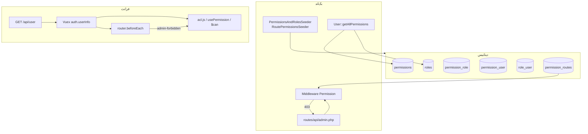

# راهنمای سیستم کنترل دسترسی (ACL)

این سند نحوه کار، فایل‌های درگیر، و روش تغییر/استفاده از پرمیشن‌ها و نقش‌ها را در **بک‌اند (Laravel)** و **فرانت (Vue)** توضیح می‌دهد.

---

## ۱. تصویر کلی

سیستم دسترسی در سه لایه کار می‌کند:



| لایه | چه چیزی را کنترل می‌کند؟ |
|------|--------------------------|
| **نقش و پرمیشن (DB)** | اینکه کاربر *اصلاً* چه کارهایی می‌تواند بکند |
| **permission_routes (API)** | هر endpoint ادمین (`api.admin.*`) به کدام پرمیشن نیاز دارد |
| **meta.can (فرانت)** | نمایش صفحه/منو/دکمه در پنل `/admin` |

> **مهم:** فرانت فقط UI را مخفی/مسدود می‌کند. **امنیت واقعی در API** است (middleware + permission_routes).

---

## ۲. جداول دیتابیس

| جدول | نقش |
|------|-----|
| `permissions` | لیست پرمیشن‌ها (`name`, `label`) |
| `roles` | لیست نقش‌ها (`name`, `label`) |
| `permission_role` | پرمیشن‌های هر نقش |
| `role_user` | نقش‌های هر کاربر |
| `permission_user` | پرمیشن **مستقیم** روی کاربر (بدون نقش) |
| `permission_routes` | نگاشت `route_name` → `permission_id` برای API |

### منطق ترکیب پرمیشن کاربر

```
پرمیشن‌های نهایی کاربر =
    پرمیشن‌های مستقیم (permission_user)
  + پرمیشن‌های نقش‌ها (role_user → permission_role)
```

- **Superuser** (`is_superuser = 1`): همه‌جا bypass — نیازی به پرمیشن ندارد.
- پرمیشن‌های نقش و مستقیم **جمع** می‌شوند (union).

---

## ۳. بک‌اند

### ۳.۱ فایل‌های کلیدی

| فایل | کاربرد |
|------|--------|
| `database/seeders/PermissionsAndRolesSeeder.php` | تعریف پرمیشن‌ها، نقش‌ها، و نگاشت role→permission |
| `database/seeders/RoutePermissionsSeeder.php` | نگاشت route `api.admin.*` → permission (متد `routePermissionMap()`) |
| `database/seeders/DatabaseSeeder.php` | ترتیب اجرای seederها |
| `routes/api/admin.php` | تعریف routeهای ادمین (prefix نام: `api.admin.`) |
| `app/Http/Middleware/Permission.php` | بررسی دسترسی روی **همه** routeهای API |
| `app/Http/Kernel.php` | middleware `Permission` داخل گروه `api` |
| `app/Models/User.php` | متدهای `getAllPermissions`, `hasPermissionName`, ... |
| `app/Models/Permission.php` | مدل پرمیشن |
| `app/Models/Role.php` | مدل نقش |
| `app/Models/PermissionRoute.php` | مدل نگاشت route→permission |
| `app/Http/Controllers/Api/Admin/Security/RouteAccessController.php` | UI مدیریت نگاشت route→permission در ادمین |
| `routes/api/auth.php` | endpoint `GET /api/user` — برگرداندن roles و permissions |

### ۳.۲ Middleware API (`Permission`)

روی **هر** درخواست API (گروه `api` در `Kernel.php`):

1. اگر کاربر لاگین نیست → رد نمی‌کند (فقط برای authenticated چک می‌شود).
2. اگر `is_superuser` → اجازه.
3. نام route فعلی را می‌گیرد (مثلاً `api.admin.users`).
4. از جدول `permission_routes` پرمیشن‌های آن route را می‌خواند.
5. **اگر هیچ رکوردی نباشد → اجازه** (route باز برای هر کاربر لاگین‌شده).
6. **اگر رکورد باشد → OR:** کاربر باید **حداقل یکی** از پرمیشن‌ها را داشته باشد.
7. در غیر این صورت → `403`.

### ۳.۳ متدهای `User` (بک‌اند)

```php
$user->getAllPermissions();           // Collection — مستقیم + از نقش
$user->hasPermissionName('users.view'); // bool
$user->hasAnyPermissionName(['users.view', 'users.create']); // bool
$user->hasPermission($permissionModelOrString); // bool — از hasPermissionName استفاده می‌کند
$user->hasRole($rolesCollection);    // bool — فقط برای چک نقش (نه پرمیشن)
$user->isSuperUser();               // bool
```

### ۳.۴ endpoint کاربر

`GET /api/user` (Sanctum):

```json
{
  "permissions": ["users.view", "courses.list", ...],
  "roles": ["user_admin", ...],
  "is_superuser": false
}
```

`permissions` از `getAllPermissions()` پر می‌شود (شامل پرمیشن نقش‌ها).

---

## ۴. فرانت

### ۴.۱ فایل‌های کلیدی

| فایل | کاربرد |
|------|--------|
| `src/utils/acl.js` | توابع پایه: `hasAnyPermission`, `hasPermission`, `isSuperUser`, ... |
| `src/utils/routePermissions.js` | `canAccessRoute`, `getRouteAccessRedirect` — بر اساس `meta.can` |
| `src/composables/usePermission.js` | composable برای Composition API |
| `src/plugins/permission.js` | `$can`, `$canAll`, `$canRoute` برای Options API / template |
| `src/routes/router.js` | `meta.can` روی routeهای `/admin` + guard |
| `src/views/components/admin/SidebarMenu.vue` | فیلتر منو با `canAccessRoute` |
| `src/store/auth.module.js` | `refreshUser` — به‌روزرسانی permissions بعد از تغییر نقش |

### ۴.۲ منطق دسترسی فرانت

| بررسی | منطق | کجا |
|-------|------|-----|
| ورود به `/admin` | superuser **یا** حداقل یکی از پرمیشن‌های `meta.can` صفحات admin | `canAccessAdminArea` |
| ورود به یک صفحه admin | superuser **یا** حداقل یکی از `meta.can` همان route | `getRouteAccessRedirect` |
| نمایش منو/دکمه | superuser **یا** حداقل یکی از پرمیشن‌های route مقصد | `$can` / `can()` |

**منطق OR:** اگر `meta.can: ['courses.view', 'courses.view.own']` باشد، داشتن **یکی** کافی است.

**منطق AND:** از `canAll` / `$canAll` / `hasAllPermissions` استفاده کن.

### ۴.۳ متدهای فرانت

#### `acl.js` (تابع مستقل — بدون Vue)

| تابع | توضیح |
|------|--------|
| `extractPermissionNames(user)` | آرایه نام پرمیشن‌ها |
| `extractRoleNames(user)` | آرایه نام نقش‌ها |
| `isSuperUser(user)` | فقط `is_superuser` |
| `hasAnyPermission(user, required)` | OR — رایج‌ترین |
| `hasAllPermissions(user, required)` | AND |
| `hasPermission(user, name)` | یک پرمیشن |
| `hasRole(user, roleName)` | یک نقش |
| `hasAnyRole(user, roles)` | OR روی نقش‌ها |
| `collectAdminPermissions(routes)` | اتحاد همه `meta.can` مسیرهای admin |
| `canAccessAdminArea(user, allAdminPerms)` | آیا اصلاً حق ورود به admin دارد؟ |

#### `usePermission()` (Composition API)

```js
import { usePermission } from '@/composables/usePermission';

const { can, canAll, canRoute, canAccessAdmin, hasRole, isSuper, permissions, roles } = usePermission();

if (can('users.create')) { /* ... */ }
if (canRoute('admin-users-list')) { /* ... */ }
if (canAll(['security.routes.view', 'security.routes.manage'])) { /* ... */ }
```

| متد | کاربرد |
|-----|--------|
| `can(perm \| perm[])` | OR permission |
| `canAll(perm[])` | AND permission |
| `canRoute(routeName)` | دسترسی به route بر اساس `meta.can` |
| `canAccessAdmin()` | ورود به ناحیه admin |
| `hasRole(role \| role[])` | OR role |
| `isSuper()` | superuser |
| `checkPermission(required, onAllowed, onDenied)` | callback |
| `redirectIfNoPermission(required)` | ریدایرکت به `admin-forbidden` |
| `redirectIfNoRole(roles)` | ریدایرکت بر اساس نقش |

#### Options API / Template

```vue
<button v-if="$can('courses.create')">ایجاد دوره</button>
<router-link v-if="$canRoute('admin-courses-list')">دوره‌ها</router-link>
```

پلاگین در `src/plugins/permission.js` ثبت شده و `$can`, `$canAll`, `$canRoute` را فراهم می‌کند.

#### `routePermissions.js`

| تابع | توضیح |
|------|--------|
| `getRoutePermissions(routeName)` | لیست `meta.can` یک route |
| `canAccessRoute(user, routeName)` | آیا کاربر به route دسترسی دارد؟ |
| `getRouteAccessRedirect(user, to)` | مقصد ریدایرکت در guard (403 / NotFound) |

---

## ۵. سناریوهای رایج — چطور تغییر بدهم؟

### ۵.۱ افزودن پرمیشن جدید

1. **بک‌اند:** در `PermissionsAndRolesSeeder.php` به آرایه `$permissions` اضافه کن:
   ```php
   ['name' => 'reports.export', 'label' => 'خروجی گزارش', 'created_at' => $now, 'updated_at' => $now],
   ```
2. Seeder را اجرا کن:
   ```bash
   php artisan db:seed --class=PermissionsAndRolesSeeder
   ```
3. (اختیاری) پرمیشن را به نقش(ها) در همان فایل، بخش `$map` بده.

### ۵.۲ افزودن نقش جدید

1. در `PermissionsAndRolesSeeder.php` → `$roles` و `$map`.
2. در `$map`:
   ```php
   'my_new_role' => [
       'users.view',
       'courses.*',  // wildcard — همه courses.xxx
   ],
   ```
3. `php artisan db:seed --class=PermissionsAndRolesSeeder`

### ۵.۳ افزودن route API ادمین

1. در `routes/api/admin.php` route را با `->name('...')` تعریف کن.  
   نام نهایی: `api.admin.` + name (مثلاً `api.admin.reports.export`).

2. در `RoutePermissionsSeeder.php` → متد `routePermissionMap()`:
   ```php
   $assign('api.admin.reports.export', ['reports.export', 'analytics.view']);
   ```

3. Seeder را اجرا کن:
   ```bash
   php artisan db:seed --class=RoutePermissionsSeeder
   ```

4. **یا** از پنل ادمین → «API Routes» (`/admin/api-routes`) بدون redeploy seeder.

### ۵.۴ افزودن صفحه admin در فرانت

1. در `src/routes/router.js`:
   ```js
   {
     path: '/admin/my-page',
     name: 'admin-my-page',
     component: AdminMyPage,
     meta: {
       requiresAuth: true,
       can: ['my.permission.view', 'my.permission.view.own'], // OR
     },
   },
   ```

2. در `SidebarMenu.vue` آیتم منو با `link: 'admin-my-page'` (همان `name` route).

3. دکمه‌ها:
   ```vue
   <button v-if="$can('my.permission.create')">...</button>
   ```

4. API همان صفحه باید در `RoutePermissionsSeeder` نگاشت داشته باشد.

### ۵.۵ دادن دسترسی به یک کاربر

| روش | جدول | UI |
|-----|------|-----|
| نقش | `role_user` | ادمین → جزئیات کاربر → نقش |
| پرمیشن مستقیم | `permission_user` | ادمین → جزئیات کاربر → پرمیشن |
| Superuser | `users.is_superuser` | ادمین → toggle superuser |

بعد از تغییر نقش/پرمیشن:
- فرانت: `store.dispatch('auth/refreshUser')` یا logout/login
- بک‌اند: `getAllPermissions()` query تازه می‌زند — نیاز به restart نیست

### ۵.۶ wildcard در seeder نقش‌ها

در `PermissionsAndRolesSeeder` → `$map`:

| الگو | معنی |
|------|------|
| `'*'` | همه پرمیشن‌ها (فقط `administrator`) |
| `'users.*'` | همه پرمیشن‌هایی که با `users.` شروع می‌شوند |
| `'users.view'` | فقط همان پرمیشن |

---

## ۶. نام‌گذاری پرمیشن‌ها (قرارداد پروژه)

```
{module}.{action}
{module}.{action}.{scope}   // scope: own | any
```

مثال‌ها:

| نام | معنی |
|-----|------|
| `users.view` | مشاهده کاربران |
| `courses.update.own` | ویرایش دوره‌های خود |
| `courses.update.any` | ویرایش هر دوره |
| `security.routes.manage` | مدیریت نگاشت route→permission |
| `admin.search_user` | جستجوی کاربر در ادمین |

---

## ۷. UI مدیریت در پنل ادمین

| صفحه | route فرانت | API | پرمیشن UI |
|------|-------------|-----|-----------|
| پرمیشن‌ها | `admin-permissions-list` | `api.admin.permissions.*` | `security.access.view` |
| نقش‌ها | `admin-roles-list` | `api.admin.roles.*` | `security.access.view` |
| API Routes | `admin-api-routes` | `api.admin.routes.*` | `security.routes.view` / `manage` |
| Forbidden | `admin-forbidden` | — | فقط `requiresAuth` |

`RouteAccessController` لیست routeهای API و پرمیشن‌های هر کدام را نشان می‌دهد و CRUD روی `permission_routes` انجام می‌دهد.

---

## ۸. دستورات مفید

```bash
# پرمیشن‌ها + نقش‌ها + role-permission
php artisan db:seed --class=PermissionsAndRolesSeeder

# نگاشت route API → permission
php artisan db:seed --class=RoutePermissionsSeeder

# seed کامل (شامل هر دو)
php artisan db:seed
```

---

## ۹. نکات مهم و اشتباهات رایج

### ۹.۱ فرانت ≠ امنیت API

حتی اگر دکمه را با `v-if="$can(...)"` مخفی کنی، بدون نگاشت در `permission_routes` کاربر می‌تواند مستقیم API را صدا بزند (مگر route نگاشت نداشته باشد — که در admin نباید اینطور باشد).

### ۹.۲ OR روی یک route

اگر روی یک route چند پرمیشن بگذاری (`view` + `create`)، داشتن **view** هم برای **create API** کافی است. برای routeهای write فقط پرمیشن write بگذار.

### ۹.۳ route بدون نگاشت = باز

در middleware اگر `permission_routes` خالی باشد → **همه** کاربران authenticated رد می‌شوند. برای routeهای admin حتماً seeder را به‌روز کن.

### ۹.۴ Superuser

فقط `is_superuser` (نه نقش `administrator`). نقش `administrator` باید از طریق `permission_role` پرمیشن بگیرد؛ superuser از همه bypass می‌کند.

### ۹.۵ پرمیشن‌های بدون تعریف اختصاصی

| ماژول | پرمیشن استفاده‌شده | دلیل |
|-------|-------------------|------|
| Certificates | `analytics.view` | `certificates.*` در seeder نیست |
| FAQ | `articles.*` | `faqs.*` نیست — هم‌راستا با UI |
| Projects/Cooperation | `users.view` + `marketing.*` | پرمیشن اختصاصی نیست |

اگر بخواهی دقیق‌تر شود، پرمیشن جدید در seeder تعریف و نگاشت‌ها را به‌روز کن.

### ۹.۶ Cache فرانت

`collectAdminPermissions` یک بار cache می‌شود. بعد از تغییر `router.js` صفحه را refresh کن.

---

## ۱۰. چک‌لیست feature جدید

- [ ] پرمیشن(ها) در `PermissionsAndRolesSeeder.php`
- [ ] (اختیاری) نقش‌ها در `$map` همان seeder
- [ ] Route API در `routes/api/admin.php` با name
- [ ] نگاشت در `RoutePermissionsSeeder::routePermissionMap()`
- [ ] `php artisan db:seed --class=RoutePermissionsSeeder`
- [ ] Route فرانت در `router.js` با `meta.can`
- [ ] آیتم منو در `SidebarMenu.vue`
- [ ] دکمه‌های action با `$can` / `usePermission`
- [ ] تست با کاربر بدون superuser (نقش + پرمیشن مستقیم)

---

## ۱۱. دیاگرام جریان یک درخواست admin

```
کاربر → POST /api/admin/users
         ↓
    auth:sanctum (لاگین)
         ↓
    Middleware Permission
         ↓
    route name = api.admin.users
         ↓
    permission_routes → [users.view]
         ↓
    User::hasPermissionName('users.view')
      ← getAllPermissions() (مستقیم + نقش)
         ↓
    دارد → 200 | ندارد → 403
```

```
کاربر → /admin/users (Vue)
         ↓
    router.beforeEach → refreshUser
         ↓
    meta.can: ['users.view']
         ↓
    hasAnyPermission(user, ['users.view'])
         ↓
    دارد → صفحه | ندارد → admin-forbidden
```

---

## ۱۲. فهرست سریع فایل‌ها

### بک‌اند
- `database/seeders/PermissionsAndRolesSeeder.php`
- `database/seeders/RoutePermissionsSeeder.php`
- `routes/api/admin.php`
- `app/Http/Middleware/Permission.php`
- `app/Models/User.php`
- `app/Models/PermissionRoute.php`
- `app/Http/Controllers/Api/Admin/Security/RouteAccessController.php`

### فرانت
- `src/utils/acl.js`
- `src/utils/routePermissions.js`
- `src/composables/usePermission.js`
- `src/plugins/permission.js`
- `src/routes/router.js`
- `src/views/components/admin/SidebarMenu.vue`
- `src/store/auth.module.js`

---

*آخرین به‌روزرسانی: هم‌راستا با RoutePermissionsSeeder و middleware Permission (شامل getAllPermissions از نقش + مستقیم).*
